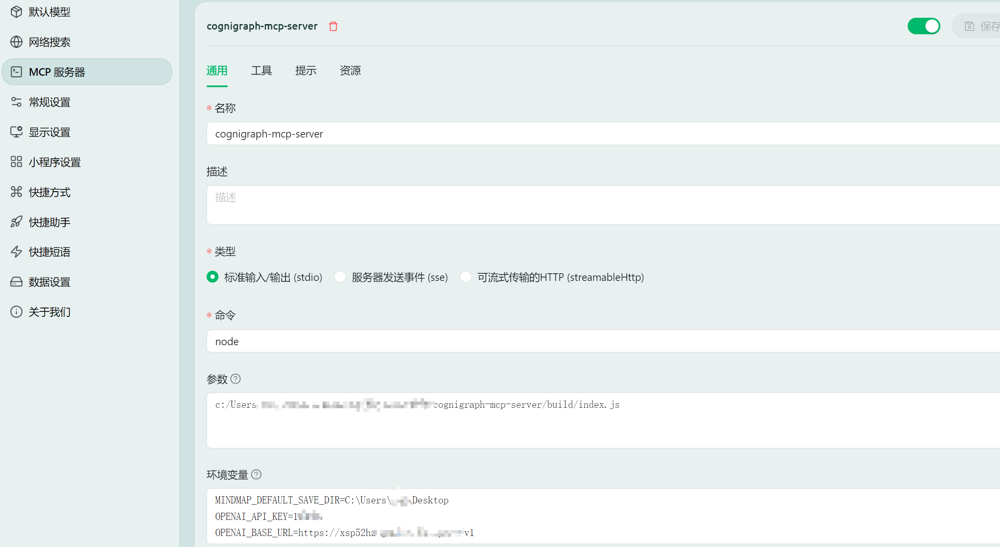

# CogniGraph MCP Server

This is a Model Context Protocol (MCP) server designed to generate mind maps, relationship graphs, and knowledge graphs using external CLI tools (`markmap-cli` and `@mermaid-js/mermaid-cli`) and AI analysis via OpenAI-compatible APIs.

This server is designed to be compatible with various local MCP clients, including Claude Desktop, Cherry Studio, DeepChat, and HyperChat.

## Features

Provides several tools accessible via the MCP `use_mcp_tool` command:

1.  **`generate_mindmap`**:
    *   Generates a mind map from Markdown text.
    *   Returns the resulting HTML or SVG content directly.
    *   Input: `markdown` (string, required), `outputFormat` (enum: "html" | "svg", optional, default: "html").

2.  **`generate_and_save_mindmap`**:
    *   Generates a mind map from Markdown text.
    *   Saves the result (HTML or SVG) to a file.
    *   Input: `markdown` (string, required), `outputFormat` (enum: "html" | "svg", optional, default: "html"), `outputDir` (string, optional), `outputFilename` (string, optional).
    *   Default save location is determined by `MINDMAP_DEFAULT_SAVE_DIR` environment variable, falling back to the user's home directory.

3.  **`generate_relationship_graph`**:
    *   Generates a relationship graph from Mermaid syntax text.
    *   Saves the result (SVG or PNG) to a file.
    *   Input: `mermaid_text` (string, required), `outputFormat` (enum: "svg" | "png", optional, default: "svg"), `outputDir` (string, optional), `outputFilename` (string, optional).
    *   Default save location is determined by `MINDMAP_DEFAULT_SAVE_DIR` environment variable, falling back to the user's home directory.

4.  **`generate_knowledge_graph`**:
    *   Analyzes Markdown text using an AI model (via OpenAI-compatible API).
    *   Generates Mermaid code representing the knowledge graph.
    *   Renders the Mermaid code to an image (SVG or PNG) and saves it to a file.
    *   Input: `markdown` (string, required), `outputFormat` (enum: "svg" | "png", optional, default: "svg"), `outputDir` (string, optional), `outputFilename` (string, optional), `prompt` (string, optional), `model` (string, optional), `apiKey` (string, optional), `baseURL` (string, optional).
    *   Requires API access configuration (see below). Default save location follows the same logic as other save tools.

## Configuration (via MCP Settings `env`)

The server relies on environment variables set within the MCP client's settings file (e.g., `mcp_settings.json`) for certain functionalities:

*   **`MINDMAP_DEFAULT_SAVE_DIR`**: (Optional) Sets the default directory for tools that save files (`generate_and_save_mindmap`, `generate_relationship_graph`, `generate_knowledge_graph`) if `outputDir` is not provided in the arguments.
    *   **If this variable is NOT set:** These tools will default to saving files in the user's home directory. The `generate_mindmap` tool (which returns content directly) remains unaffected.
*   **`OPENAI_API_KEY`**: (Required for `generate_knowledge_graph`) Your API key for the OpenAI or compatible service.
    *   **If this variable is NOT set (and not provided via `apiKey` argument):** The `generate_knowledge_graph` tool will fail. Other tools are unaffected.
*   **`OPENAI_BASE_URL`**: (Optional) The base URL for the OpenAI-compatible API endpoint. Defaults to the official OpenAI API if not set. Only relevant for `generate_knowledge_graph`.
*   **`OPENAI_DEFAULT_MODEL`**: (Optional) The default AI model name for `generate_knowledge_graph`. Defaults to `gpt-3.5-turbo` if not set. Only relevant for `generate_knowledge_graph`.

**Important Notes on Configuration:**
*   The `generate_mindmap` tool (Tool 1) does not depend on any of these environment variables.
*   Tools 2 and 3 (`generate_and_save_mindmap`, `generate_relationship_graph`) depend only on `MINDMAP_DEFAULT_SAVE_DIR` for their *default* save location. They still function (saving to the home directory) if it's not set.
*   Tool 4 (`generate_knowledge_graph`) **requires** `OPENAI_API_KEY` (either via env var or argument) to function at all. It also uses the other `OPENAI_*` variables and `MINDMAP_DEFAULT_SAVE_DIR`.

Example `mcp_settings.json` entry:

```json
{
  "mcpServers": {
    "cognigraph-mcp-server": { // Ensure server name matches
      "command": "node",
      "args": [
        "/path/to/cognigraph-mcp-server/build/index.js" // Adjust path accordingly
      ],
      "env": {
        "MINDMAP_DEFAULT_SAVE_DIR": "C:\\Users\\YourUser\\Desktop",
        "OPENAI_API_KEY": "sk-...",
        "OPENAI_BASE_URL": "http://localhost:11434/v1", // Example for local Ollama
        "OPENAI_DEFAULT_MODEL": "llama3"
      },
      "disabled": false,
      "alwaysAllow": []
    }
    // ... other servers
  }
}
```

## Setup

1.  Clone this repository.
2.  Navigate into the `cognigraph-mcp-server` directory.
3.  Configure the server in your MCP client's settings file as shown above, ensuring the server name (`cognigraph-mcp-server`) and path in `args` are correct. Provide necessary environment variables.
4.  Restart your MCP client to load the server.

## Usage

Use the tools via your MCP client's `use_mcp_tool` functionality. Refer to the tool descriptions above for arguments.

Here is an example configuration screenshot from Cherry Studio:


## Usage via npx

You can now quickly start this MCP server using the `npx` command, without needing to manually clone and build the repository.

1.  **Ensure Node.js and npm are installed.**
2.  **Update your MCP client's settings file (`mcp_settings.json` or similar):**

    Change the `command` in the server configuration to `npx` and set `args` to `["cognigraph-mcp-server"]`. Remove the previous path pointing to the local `build/index.js`.

    **New Configuration Example:**

    ```json
    {
      "mcpServers": {
        "cognigraph-mcp-server": { // Server name remains the same
          "command": "npx", // Use npx
          "args": [
            "cognigraph-mcp-server" // Package name
          ],
          "env": { // Environment variables remain the same
            "MINDMAP_DEFAULT_SAVE_DIR": "C:\\Users\\YourUser\\Desktop",
            "OPENAI_API_KEY": "sk-...",
            "OPENAI_BASE_URL": "http://localhost:11434/v1",
            "OPENAI_DEFAULT_MODEL": "llama3"
          },
          "disabled": false,
          "alwaysAllow": []
        }
        // ... other servers
      }
    }
    ```
3.  **Restart your MCP client.** The client will now use npx to download (if necessary) and run the latest published version of `cognigraph-mcp-server`.

**Note:** When using npx, environment variables for the server (like `OPENAI_API_KEY`) still need to be passed through the MCP client's `env` settings.