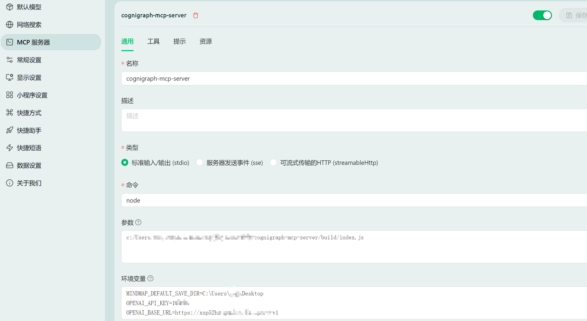

# CogniGraph MCP 服务器

这是一个模型上下文协议 (MCP) 服务器，旨在使用外部命令行工具 (`markmap-cli` 和 `@mermaid-js/mermaid-cli`) 以及通过兼容 OpenAI 的 API 进行 AI 分析来生成思维导图、关系图谱和知识图谱。

此服务器设计为与各种本地 MCP 客户端兼容，包括 Claude Desktop、Cherry Studio、DeepChat 和 HyperChat。

## 功能

提供可通过 MCP `use_mcp_tool` 命令访问的多个工具：

1.  **`generate_mindmap`**:
    *   从 Markdown 文本生成思维导图。
    *   直接返回生成的 HTML 或 SVG 内容。
    *   输入: `markdown` (字符串, 必需), `outputFormat` (枚举: "html" | "svg", 可选, 默认: "html")。

2.  **`generate_and_save_mindmap`**:
    *   从 Markdown 文本生成思维导图。
    *   将结果 (HTML 或 SVG) 保存到文件。
    *   输入: `markdown` (字符串, 必需), `outputFormat` (枚举: "html" | "svg", 可选, 默认: "html"), `outputDir` (字符串, 可选), `outputFilename` (字符串, 可选)。
    *   默认保存位置由 `MINDMAP_DEFAULT_SAVE_DIR` 环境变量确定，如果未设置则回退到用户的主目录。

3.  **`generate_relationship_graph`**:
    *   从 Mermaid 语法的文本生成关系图谱。
    *   将结果 (SVG 或 PNG) 保存到文件。
    *   输入: `mermaid_text` (字符串, 必需), `outputFormat` (枚举: "svg" | "png", 可选, 默认: "svg"), `outputDir` (字符串, 可选), `outputFilename` (字符串, 可选)。
    *   默认保存位置由 `MINDMAP_DEFAULT_SAVE_DIR` 环境变量确定，如果未设置则回退到用户的主目录。

4.  **`generate_knowledge_graph`**:
    *   使用 AI 模型（通过兼容 OpenAI 的 API）分析 Markdown 文本。
    *   生成表示知识图谱的 Mermaid 代码。
    *   将 Mermaid 代码渲染成图像 (SVG 或 PNG) 并保存到文件。
    *   输入: `markdown` (字符串, 必需), `outputFormat` (枚举: "svg" | "png", 可选, 默认: "svg"), `outputDir` (字符串, 可选), `outputFilename` (字符串, 可选), `prompt` (字符串, 可选), `model` (字符串, 可选), `apiKey` (字符串, 可选), `baseURL` (字符串, 可选)。
    *   需要配置 API 访问权限（见下文）。默认保存位置遵循与其他保存工具相同的逻辑。

## 配置 (通过 MCP 设置 `env`)

服务器依赖 MCP 客户端设置文件（例如 `mcp_settings.json`）中设置的环境变量来实现某些功能：

*   **`MINDMAP_DEFAULT_SAVE_DIR`**: (可选) 为保存文件的工具（`generate_and_save_mindmap`, `generate_relationship_graph`, `generate_knowledge_graph`）设置默认输出目录（如果参数中未提供 `outputDir`）。
    *   **如果未设置此变量：** 这些工具将默认保存文件到用户的主目录。`generate_mindmap` 工具（直接返回内容）不受影响。
*   **`OPENAI_API_KEY`**: (运行 `generate_knowledge_graph` 时必需) 用于 OpenAI 或兼容服务的 API 密钥。
    *   **如果未设置此变量（且未通过 `apiKey` 参数提供）：** `generate_knowledge_graph` 工具将失败。其他工具不受影响。
*   **`OPENAI_BASE_URL`**: (可选) 兼容 OpenAI 的 API 端点的基础 URL。如果未设置，则默认为 OpenAI 官方 API。仅与 `generate_knowledge_graph` 相关。
*   **`OPENAI_DEFAULT_MODEL`**: (可选) `generate_knowledge_graph` 使用的默认 AI 模型名称。如果未设置，则默认为 `gpt-3.5-turbo`。仅与 `generate_knowledge_graph` 相关。

**重要配置说明：**
*   `generate_mindmap` 工具（工具 1）不依赖任何这些环境变量。
*   工具 2 和 3（`generate_and_save_mindmap`, `generate_relationship_graph`）仅依赖 `MINDMAP_DEFAULT_SAVE_DIR` 来确定*默认*保存位置。如果未设置，它们仍可工作（保存到主目录）。
*   工具 4（`generate_knowledge_graph`）**必需** `OPENAI_API_KEY`（通过环境变量或参数）才能运行。它也会使用其他的 `OPENAI_*` 变量和 `MINDMAP_DEFAULT_SAVE_DIR`。

`mcp_settings.json` 配置示例：

```json
{
  "mcpServers": {
    "cognigraph-mcp-server": { // 确保服务器名称匹配
      "command": "node",
      "args": [
        "/path/to/cognigraph-mcp-server/build/index.js" // 根据实际情况调整路径
      ],
      "env": {
        "MINDMAP_DEFAULT_SAVE_DIR": "C:\\Users\\YourUser\\Desktop",
        "OPENAI_API_KEY": "sk-...",
        "OPENAI_BASE_URL": "http://localhost:11434/v1", // 本地 Ollama 示例
        "OPENAI_DEFAULT_MODEL": "llama3"
      },
      "disabled": false,
      "alwaysAllow": []
    }
    // ... 其他服务器
  }
}
```

## 安装设置

1.  克隆此仓库。
2.  进入 `cognigraph-mcp-server` 目录。
3.  如上所示，在你的 MCP 客户端设置文件中配置服务器，确保服务器名称（`cognigraph-mcp-server`）和 `args` 中的路径正确。提供必要的环境变量。
4.  重启你的 MCP 客户端以加载服务器。

## 使用方法

通过你的 MCP 客户端的 `use_mcp_tool` 功能来使用这些工具。有关参数，请参阅上面的工具描述。

以下是 Cherry Studio 的配置截图示例：


## 通过 npx 使用

现在，你可以使用 `npx` 命令快速启动此 MCP 服务器，无需手动克隆和构建。

1.  **确保 Node.js 和 npm 已安装。**
2.  **更新你的 MCP 客户端设置文件 (`mcp_settings.json` 或类似文件):**

    将服务器配置中的 `command` 设置为 `npx`，并将 `args` 设置为 `["cognigraph-mcp-server"]`。移除之前指向本地 `build/index.js` 的路径。

    **新的配置示例:**

    ```json
    {
      "mcpServers": {
        "cognigraph-mcp-server": { // 服务器名称保持不变
          "command": "npx", // 使用 npx
          "args": [
            "cognigraph-mcp-server" // 包名
          ],
          "env": { // 环境变量保持不变
            "MINDMAP_DEFAULT_SAVE_DIR": "C:\\Users\\YourUser\\Desktop",
            "OPENAI_API_KEY": "sk-...",
            "OPENAI_BASE_URL": "http://localhost:11434/v1",
            "OPENAI_DEFAULT_MODEL": "llama3"
          },
          "disabled": false,
          "alwaysAllow": []
        }
        // ... 其他服务器
      }
    }
    ```
3.  **重启你的 MCP 客户端。** 客户端现在将使用 npx 来下载（如果需要）并运行最新发布的 `cognigraph-mcp-server`。

**注意:** 使用 npx 时，服务器的环境变量（如 `OPENAI_API_KEY`）仍然需要通过 MCP 客户端的 `env` 设置来传递。